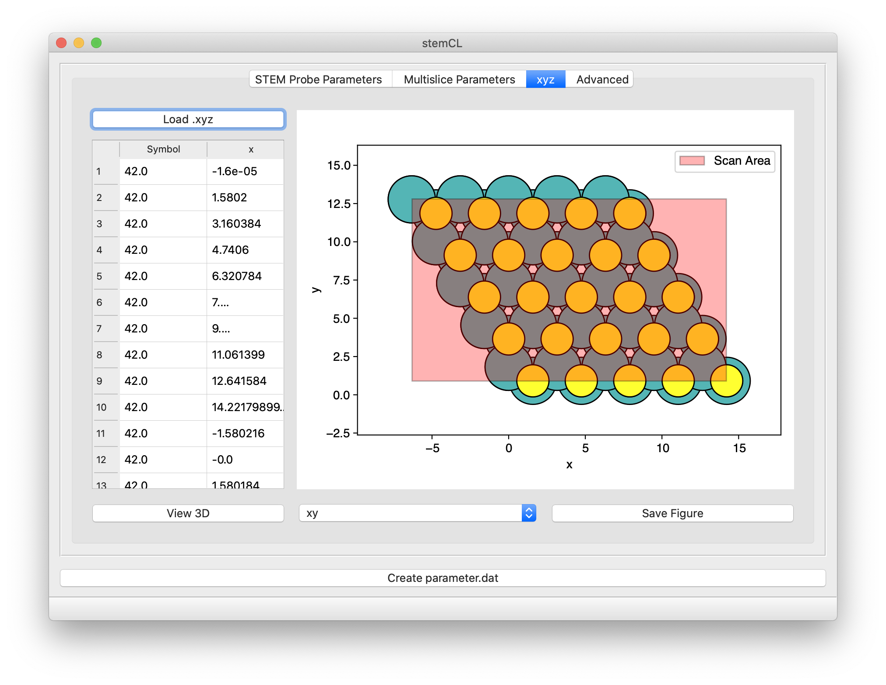
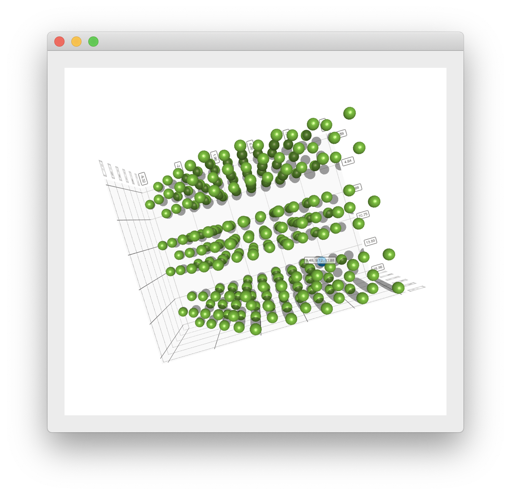

# stemCL-GUI
GUI for [stemCL](https://github.com/stemcl/stemcl) to visualize the atomic structure and simlation geometry, and to produce the necessary `parameters.dat` file.

The program may be run as:
```python -m stemCL-GUI```.



